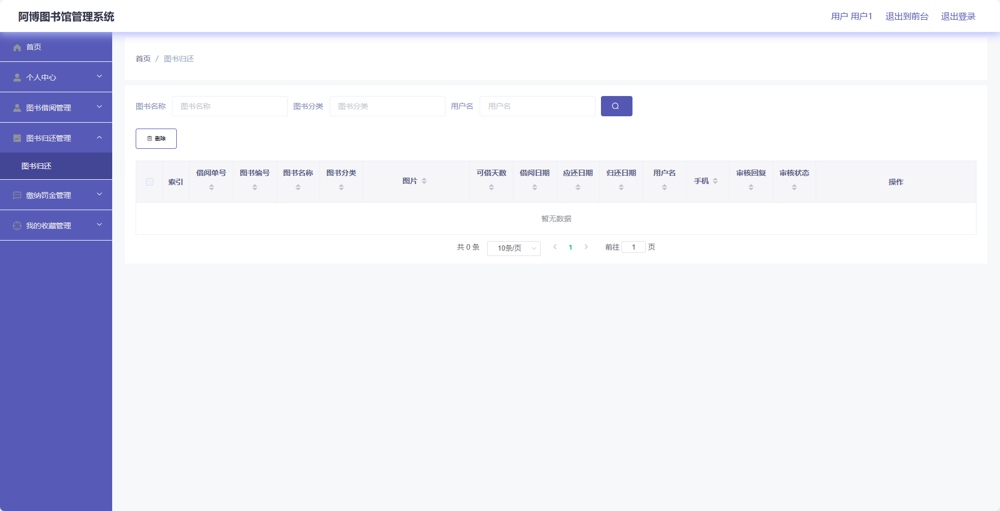

基于SpringBoot的阿博图书馆管理系统（程序+论文）
=
- 完整代码获取地址：从戎源码网 ([https://armycodes.com/](https://armycodes.com/))
- 作者微信：19941326836  QQ：952045282 
- 承接计算机毕业设计、Java毕业设计、Python毕业设计、深度学习、机器学习
- 选题+开题报告+任务书+程序定制+安装调试+论文+答辩ppt 一条龙服务

一、项目介绍
---
基于Spring Boot框架实现的阿博图书馆管理系统，系统包含两种角色：管理员、用户,系统分为前台和后台两大模块，主要功能如下。
### 【前台模块】：
1. 首页：展示图书馆的基本信息，包括新书推荐、热门图书、图书馆开放时间等。
2. 图书信息：提供用户浏览图书的功能，支持关键字搜索、查看图书详细信息、查看图书借阅情况等。
3. 公告信息：展示图书馆的公告信息，包括图书馆活动、通知公告等。
4. 留言反馈：提供用户反馈意见、建议的功能，支持留言、查看回复等。
5. 个人中心：提供用户个人信息管理、密码修改、已借图书查询、收藏夹管理等功能。

### 【后台模块 - 用户】：
1. 个人中心：提供用户个人信息管理、密码修改等功能。
2. 图书借阅管理：支持用户借阅图书、查看借阅记录、续借图书等。
3. 图书归还管理：支持用户归还图书、查看归还记录、缴纳罚金等。
4. 缴纳罚金管理：支持用户在线缴纳罚金。
5. 我的收藏管理：支持用户收藏图书、查看收藏夹等。

### 【后台模块 - 管理员】：
1. 个人中心：提供管理员个人信息管理、密码修改等功能。
2. 用户管理：支持管理员添加、删除用户、修改用户信息等。
3. 图书分类管理：支持管理员添加、删除图书分类、修改图书分类信息等。
4. 图书信息管理：支持管理员添加、删除图书、修改图书信息等。
5. 图书借阅管理：支持管理员查看所有借阅记录、审核借阅请求等。
6. 图书归还管理：支持管理员查看所有归还记录、处理罚款等。
7. 缴纳罚金管理：支持管理员查看所有罚款记录、处理罚款等。
8. 留言板管理：支持管理员查看用户留言、回复留言等。
9. 系统管理：支持管理员配置系统基本参数、备份数据等操作。

二、项目技术
---
- 编程语言：Java
- 数据库：MySQL
- 项目管理工具：Maven
- 前端技术：VUE、HTML、Jquery、Bootstrap
- 后端技术：Spring、SpringMVC、MyBatis

三、运行环境
---
- 操作系统：Windows、macOS都可以
- JDK版本：JDK1.8以上都可以
- 开发工具：IDEA、Ecplise、Myecplise都可以
- 数据库: MySQL5.7以上都可以
- Tomcat：任意版本都可以
- Maven：任意版本都可以

四、运行截图
---
### 论文截图：

### 程序截图：

